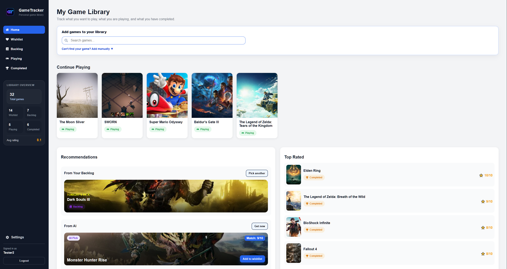
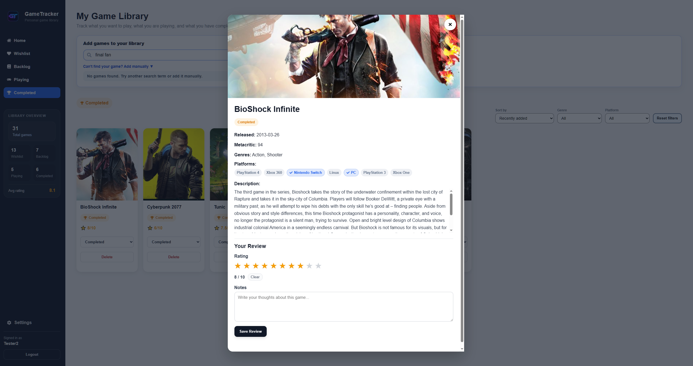
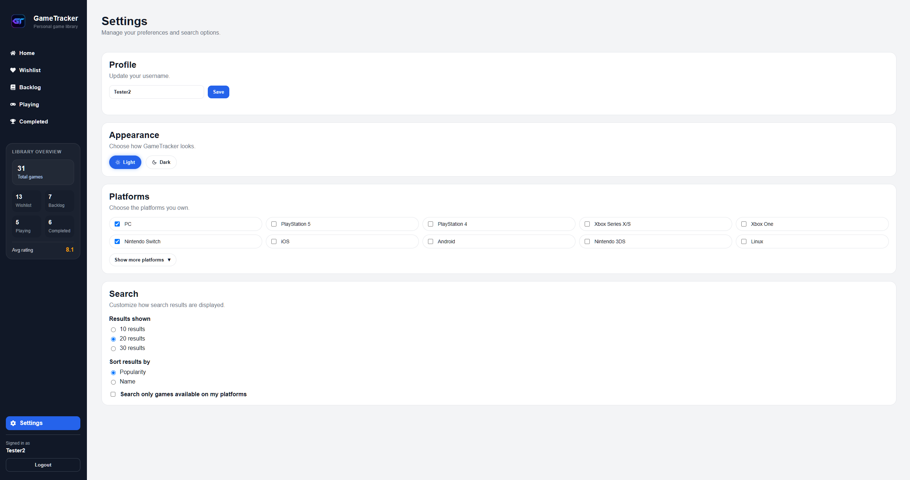

# GameTracker

A full-stack game library application for tracking games, managing personal collections, and discovering games with AI-powered recommendations.

GameTracker was built as a portfolio project to demonstrate full-stack web development skills. The goal was to create a real-world application that combines frontend development, backend APIs, databases, authentication, third-party integrations, and AI-powered features.

## 🚀 Live demo

https://game-tracker-indol.vercel.app/

## Demo Account

Visitors can use **Continue as Demo** on the login page to explore GameTracker without registering. The demo account includes a populated library across wishlist, backlog, playing and completed games, with completed-game ratings and notes for Top Rated and AI recommendations.

The demo library is restored each time the demo login endpoint is used, so changes made by visitors are not permanent. Default demo credentials are:
- Email: demo@gametracker.app
- Password: Demo123!

## Features

- Search and add games using the RAWG API
- Organize games into Wishlist, Backlog, Playing, Completed lists
- Personal game ratings and notes
- AI-powered game recommendations
- Platform ownership tracking
- User authentication with JWT
- Google login support
- Demo account for recruiters and visitors
- Customizable user settings
- Light and dark mode
- Responsive mobile-friendly design

## AI Features

- Personalized recommendations based on the user's library
- Considers completed, playing, backlog and wishlist games
- Avoids recently suggested titles
- Prefers games available on the user's selected platforms
- Confidence score for each recommendation

## Project Goals

This project was created to demonstrate full-stack development skills, including authentication, database design, REST APIs, third-party integrations, and AI-powered features.

## Tech Stack

Frontend:
- React
- React Router
- Axios
- CSS

Backend:
- Node.js
- Express

Database:
- MongoDB Atlas
- Mongoose

External APIs:
- RAWG Video Games Database API
- OpenAI API

Authentication:
- Google OAuth

## Screenshots

### Home Page

### Game Details & Reviews

### Settings

## Installation

Clone repository:
- git clone https://github.com/yourusername/gametracker.git
- cd gametracker

Backend:
- cd backend
- npm install
- npm run dev

Frontend:
- cd frontend
- npm install
- npm start

## Environment Variables

Backend:
- MONGO_URI=
- JWT_SECRET=
- OPENAI_API_KEY=
- GOOGLE_CLIENT_ID=
- DEMO_EMAIL=
- DEMO_PASSWORD=
- DEMO_USERNAME=

Frontend:
- REACT_APP_API_URL=
- REACT_APP_RAWG_API_KEY=
- REACT_APP_GOOGLE_CLIENT_ID=

## Deployment

Frontend:
- Vercel

Backend:
- Render

Database:
- MongoDB Atlas

## Future Improvements

- AI recommendation history
- Advanced user statistics
- Enhanced review and rating system
- Additional recommendation filters

## Author

- Juha-Matti Litendahl

- GitHub: https://github.com/Massajah/game-tracker
- LinkedIn: https://www.linkedin.com/in/juha-matti-litendahl-83a671244/
